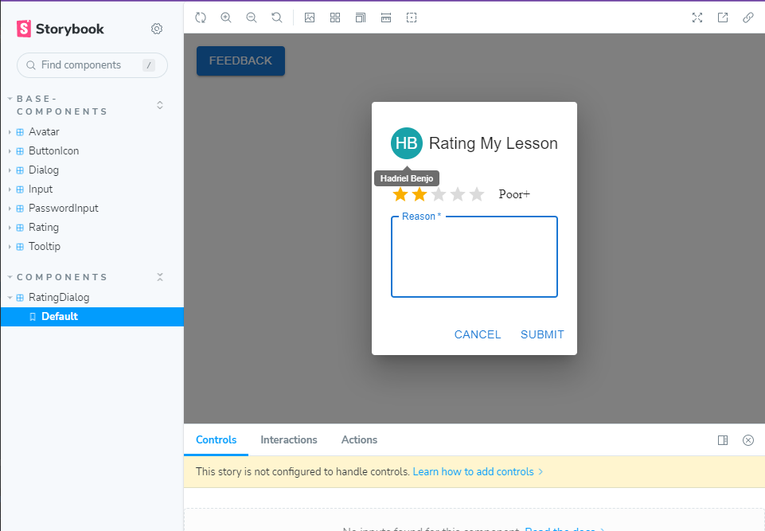

# Customize mui component
Just-Like-That project that show how to customize out our components to handle must error handling and support easy using case in out projects

#### live demo: [storybook](https://hdriel.github.io/jlt-my-mui-cmp/)  

After Mui Components APIs review [Afek Sakaju](https://github.com/afekTheMiniLearner) choosed 6 components to re-build and we develop these components into stories, 

the components are:

| Mui components    | JLT Component | 
| ----------------  | ------------- | 
| &#9744; MuiAvatar | &#9745; Avatar |
| &#9744; MuiButton | &#9745; Button |
| &#9744; MuiDialog | &#9745; Dialog |
| &#9744; TextField | &#9745; Input   &#9745; PasswordInput |
| &#9744; MuiTooltip| &#9745; Tooltip |
| &#9744; MuiRating | &#9745; Rating |

Here are the results: 

